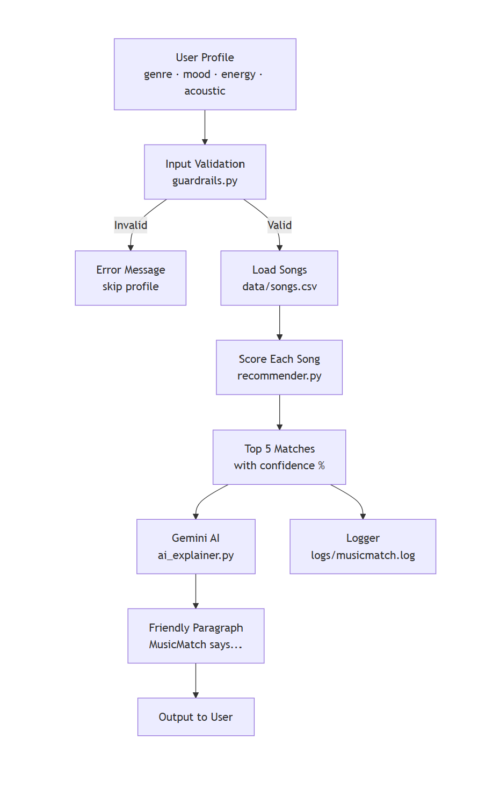

# MusicMatch Applied AI System

A content-based music recommender extended with Gemini AI to deliver friendly, personalized song explanations. Built as the final project for CodePath AI110.

---

## Base Project

This project extends **MusicMatch**, originally built in Module 3 of CodePath AI110. The original system used a pure Python scoring algorithm to recommend songs from a 30-song catalog based on a user's preferred genre, mood, energy level, and acoustic preference. It scored each song out of 6.5 points and returned the top 5 matches with raw scores and reasons. This final version keeps that scoring engine and adds a Gemini AI layer, input guardrails, confidence scoring, and logging on top of it.

Original repo: https://github.com/Linchipa/ai110-module3show-musicrecommendersimulation-starter

---

## What This System Does

MusicMatch takes a user's music taste profile and:

1. Validates the input before running anything
2. Scores every song in the catalog using a weighted algorithm
3. Returns the top 5 matches with confidence percentages
4. Sends the results to Gemini AI, which responds like a knowledgeable music friend
5. Logs every run to a file for reliability tracking

---

## Architecture Overview



The system flows in one direction: user profile → validation → recommender → AI explainer → output. Two things happen in parallel at the end: Gemini generates the friendly response, and the logger records the run. If the input is invalid, the system catches it early and skips that profile without crashing.

**Key components:**
- `src/recommender.py` — scoring engine (content-based filtering)
- `src/guardrails.py` — input validation, confidence scoring, logging
- `src/ai_explainer.py` — Gemini AI integration
- `src/main.py` — orchestrates the full pipeline
- `data/songs.csv` — 30-song catalog across 10 genres
- `logs/musicmatch.log` — runtime log file

---

## Setup Instructions

**1. Clone the repo**
```bash
git clone https://github.com/Linchipa/musicmatch-applied-ai.git
cd musicmatch-applied-ai
```

**2. Create a virtual environment (recommended)**
```bash
python -m venv .venv
.venv\Scripts\activate      # Windows
source .venv/bin/activate   # Mac/Linux
```

**3. Install dependencies**
```bash
pip install -r requirements.txt
```

**4. Set up your API key**

Create a `.env` file in the project root:
```
GEMINI_API_KEY=your_key_here
```

Get a free Gemini API key at: https://aistudio.google.com/app/api-keys

**5. Run the system**
```bash
python -m src.main
```

**6. Run tests**
```bash
pytest
```

---

## Sample Interactions

### Profile 1 — Chill Lofi
**Input:** genre=lofi, mood=chill, energy=0.35, likes_acoustic=True

**Top matches:**
```
Library Rain by Paper Lanterns  — Score: 6.43 | Confidence: 99%
Midnight Coding by LoRoom       — Score: 6.43 | Confidence: 99%
Focus Flow by LoRoom            — Score: 4.45 | Confidence: 68%
```

**MusicMatch says:**
> Hey there! So glad you're diving into the world of lofi — it's seriously the perfect vibe for a chill afternoon! I've been loving Library Rain by Paper Lanterns, it's got that beautiful, dreamy quality that's super relaxing. Midnight Coding by LoRoom is another fantastic choice — it's got that focused energy without being too intense. Let me know if you want to explore more lofi tracks!

---

### Profile 2 — Pop/Happy
**Input:** genre=pop, mood=happy, energy=0.8, likes_acoustic=False

**Top matches:**
```
Sunrise City by Neon Echo   — Score: 5.98 | Confidence: 92%
Gym Hero by Max Pulse       — Score: 4.93 | Confidence: 76%
Golden Hour by Neon Echo    — Score: 3.97 | Confidence: 61%
```

**MusicMatch says:**
> You've got great taste in upbeat pop! Sunrise City by Neon Echo is your perfect match — the energy is right in your sweet spot and the happy mood is spot on. Gym Hero brings that same high energy if you want something more intense. Golden Hour is a slightly more relaxed pop pick to round out your playlist.

---

### Profile 3 — Intense Rock
**Input:** genre=rock, mood=intense, energy=0.9, likes_acoustic=False

**Top matches:**
```
Storm Runner by Voltline    — Score: 5.99 | Confidence: 92%
Broken Neon by Voltline     — Score: 3.82 | Confidence: 59%
Mountain Echo by Voltline   — Score: 3.58 | Confidence: 55%
```

**MusicMatch says:**
> If you're looking for high-energy rock, Storm Runner by Voltline is exactly what you need — it nails your genre, mood, and energy all at once. Broken Neon has that same raw Voltline sound with a moodier edge. Mountain Echo rounds things out with a slightly more atmospheric rock feel.

---

## Design Decisions

**Why content-based filtering?**
Content-based filtering scores each song directly against the user's stated preferences. It is transparent — you can see exactly why each song was recommended — and it works without needing data from other users. The trade-off is it cannot discover songs the user wouldn't think to ask for.

**Why genre is weighted highest (+3.0)**
Genre is the strongest predictor of whether someone will enjoy a song. A rock fan rarely enjoys jazz even if the mood matches. Weighting genre at +3.0 (vs. mood at +2.0) reflects this.

**Why Gemini instead of showing raw scores**
Raw scores like "5.98" are not meaningful to most users. Gemini translates those numbers into a conversational response that explains the recommendation in human terms, making the system feel approachable rather than mechanical.

**Why guardrails before the recommender runs**
Catching bad input early prevents confusing results. If a user sets energy to 5.0 or types an unrecognized genre, the system should explain the problem clearly rather than returning nonsense recommendations.

---

## Testing Summary

- **Unit tests** (`pytest`) cover the `Recommender` class — sorting by score and generating non-empty explanations. Both pass.
- **Input validation** was tested with invalid genre, out-of-range energy, and wrong data types — all caught correctly with clear error messages.
- **Confidence scoring** was verified: a perfect score of 6.5 returns 100%, a score of 5.99 returns 92%.
- **Logging** was confirmed by checking `logs/musicmatch.log` after each run — entries appear correctly with timestamp, user profile, top pick, and confidence.
- **AI responses** were reviewed across all 3 profiles — Gemini consistently produced friendly, specific, on-topic paragraphs.

One limitation found during testing: the free tier of the Gemini API has rate limits. Running the system many times quickly will trigger a temporary block. The 10-second delay between profiles reduces this risk.

---

## Reflection

Building MusicMatch into a full applied AI system taught me that adding AI to a project is not just about making it smarter — it is about making it more human. The scoring algorithm was already working well, but the raw output felt cold. Connecting it to Gemini changed the experience entirely.

The biggest challenge was not the code — it was understanding what the AI needed to know to give a good answer. Writing a clear prompt that gave Gemini the right context (the user's profile, the song list, the reasons for each match) made the difference between a generic response and one that felt genuinely helpful.

I also learned that reliability requires thinking about failure. What happens when the input is wrong? What happens when the API is unavailable? Building guardrails and fallback messages made the system trustworthy, not just functional.

---

## Demo Walkthrough

[Add Loom video link here after recording]

---

## Repository

GitHub: https://github.com/Linchipa/musicmatch-applied-ai
